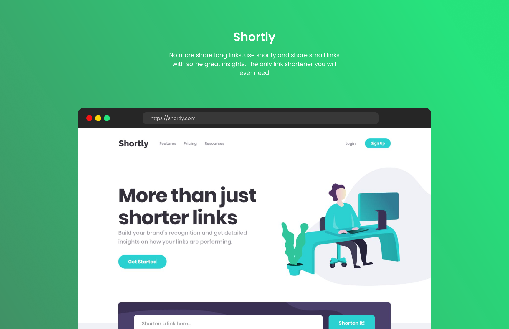

# Frontend Mentor - Shortly URL shortening API Challenge solution

This is a solution to the [Shortly URL shortening API Challenge challenge on Frontend Mentor](https://www.frontendmentor.io/challenges/url-shortening-api-landing-page-2ce3ob-G). Frontend Mentor challenges help you improve your coding skills by building realistic projects.

## Table of contents

- [Overview](#overview)
  - [The challenge](#the-challenge)
  - [Screenshot](#screenshot)
  - [Links](#links)
- [My process](#my-process)
  - [Built with](#built-with)
  - [What I learned](#what-i-learned)
  - [Continued development](#continued-development)
  - [Useful resources](#useful-resources)
- [Author](#author)
- [Acknowledgments](#acknowledgments)

## Overview

### The challenge

Users should be able to:

- View the optimal layout for the site depending on their device's screen size
- Shorten any valid URL
- See a list of their shortened links, even after refreshing the browser
- Copy the shortened link to their clipboard in a single click
- Receive an error message when the `form` is submitted if:
  - The `input` field is empty

### Screenshot



### Links

- Solution URL: [GitHub Repository](https://github.com/yourusername/url-shortner)
- Live Site URL: [Live Demo](https://url-shortner-two-tau.vercel.app/)

## My process

### Built with

- Semantic HTML5 markup
- CSS custom properties
- Flexbox
- CSS Grid
- Mobile-first workflow
- [React](https://reactjs.org/) - JS library
- [Vite](https://vitejs.dev/) - Build tool
- [Tailwind CSS](https://tailwindcss.com/) - CSS framework
- [shrtco.de API](https://shrtco.de/) - URL shortening service

### What I learned

During this project, I learned several important concepts and techniques:

**React Hooks and State Management**

```jsx
const [url, setUrl] = useState("")
const [links, setLinks] = useState(getStoredLinks)
const [error, setError] = useState(false)
```

**API Integration and Error Handling**

```jsx
const shortenLink = async (e) => {
  e.preventDefault()
  if (url.replaceAll(" ", "") === "") {
    setError(true)
    return
  }

  const res = await fetch(`https://api.shrtco.de/v2/shorten?url=${url}`)
  const fetchedLink = await res.json()
  fetchedLink.ok ? setLinks([...links, fetchedLink.result]) : setError(true)
}
```

**LocalStorage Integration**

```jsx
useEffect(() => {
  localStorage.setItem("links", JSON.stringify(links))
}, [links])
```

**Clipboard API Usage**

```jsx
const copyLink = async () => {
  await navigator.clipboard.writeText(data.full_short_link)
  setCopied(true)
}
```

**Responsive Design with Tailwind CSS**

```jsx
<div className="flex flex-col lg:flex-row lg:items-center lg:justify-between w-full lg:py-4 lg:px-5 bg-white rounded-md">
```

**Migration from Create React App to Vite**
I successfully migrated the project from Create React App to Vite, which provided:

- Faster development server startup
- Improved Hot Module Replacement (HMR)
- Better build performance
- Modern ES modules support

### Continued development

In future projects, I plan to focus on:

1. **TypeScript Integration**: Adding TypeScript for better type safety and developer experience
2. **Testing**: Implementing unit tests with Jest and React Testing Library
3. **Advanced State Management**: Exploring Redux Toolkit or Zustand for complex state management
4. **Performance Optimization**: Implementing React.memo, useMemo, and useCallback for better performance
5. **Accessibility**: Enhancing accessibility features with ARIA labels and keyboard navigation
6. **PWA Features**: Adding service workers and offline functionality
7. **Backend Integration**: Building a custom backend API instead of relying on external services

### Useful resources

- [React Documentation](https://reactjs.org/docs/getting-started.html) - Official React documentation helped me understand hooks and component lifecycle
- [Vite Documentation](https://vitejs.dev/guide/) - Essential for understanding the migration from CRA to Vite
- [Tailwind CSS Documentation](https://tailwindcss.com/docs) - Comprehensive guide for utility-first CSS
- [shrtco.de API Documentation](https://shrtco.de/) - Free URL shortening API documentation
- [Frontend Mentor](https://www.frontendmentor.io/) - Great platform for practicing frontend development
- [MDN Web Docs - Clipboard API](https://developer.mozilla.org/en-US/docs/Web/API/Clipboard_API) - Helped me implement copy to clipboard functionality
- [CSS Grid Guide](https://css-tricks.com/snippets/css/complete-guide-grid/) - Excellent resource for CSS Grid layout

## Author

- Frontend Mentor - [@yourusername](https://www.frontendmentor.io/profile/yourusername)
- GitHub - [@yourusername](https://github.com/yourusername)

## Acknowledgments

- **Frontend Mentor** - For providing this amazing challenge that helped me improve my React and responsive design skills
- **shrtco.de** - For providing a free and reliable URL shortening API
- **Vite Team** - For creating an excellent build tool that significantly improved development experience
- **Tailwind CSS Team** - For the utility-first CSS framework that made styling much more efficient
- **React Team** - For the amazing JavaScript library that powers this application

This project was completed as part of the Frontend Mentor challenges to improve coding skills and build realistic projects.
